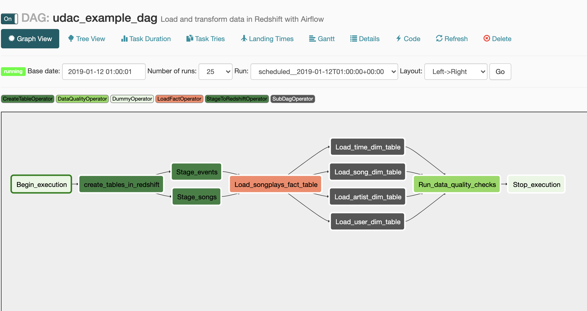

## Udacity Data Pipeline Project

In this particular project we are creating an ETL pipeline for a fictional company called Sparkify. Sparkify is a streaming music service. They have decided to incorporate more automation and robustness in their pipelines and infrastructure.

  The management is also concerned with data quality, most likely so that data scientists do not have to perform ETL to gain valuable insight into the data. Also, in traditional business intelligence efforts it is imperative to deliver accurate data as financial and operational decisions are made from the analysis performed on the data.

## Project Steps

The structure of the project is as follows;

    * dags
      ** udac_example.py
      ** dimension_subdag.py

    * plugins
      ** helpers
        *** sql_queries.py

    * operators
      ** __init__.py
      ** create_table.py
      ** data_quality.py
      ** load_dimension.py
      ** load_fact.py
      ** stage_redshift.py

## Dags

  The Dag does a number of things in sequence in order to insert json files from an s3 bucket to a redshift cluster (sql database). The task sequence looks as such;

## Steps

  1. Create tables in Redshift - In sql creating tables in the redshift cluster if they do not exist already
  2. Stage events and Songs - Here we are copying the data from s3 and staging it within redshift.
  3. load songplays fact table -- this is where we load data into our main fact table
  4. In the next step we are loading each of the dimension tables. We are doing this by using an operator contained in a subdag. Since this step is repetitive and similar across all dimension tables, we want to make sure to not duplicate efforts.
  5. Finally, we run some quality checks.

  ## Conclusion

  In reality, this job would be set to run at a daily or perhaps a 12 hour sequence. And, we were able to query each of the data tables to determine that there was data in each. Although, we did not need to because we have a built in quality check within our last step. 
